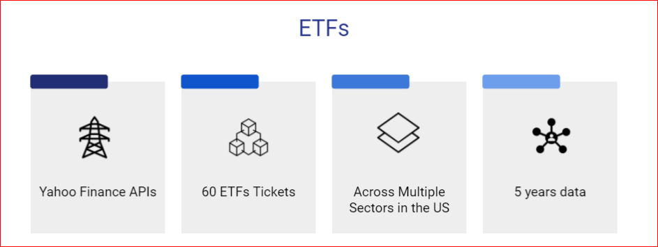
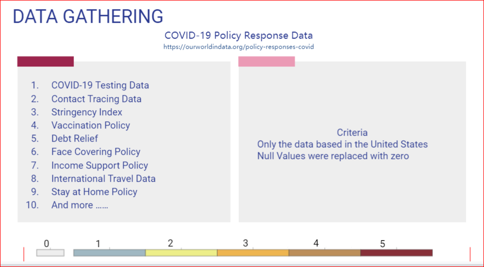

# "Portfolio Optimization Prediction with Machine Learning"
Project-2 Group-2

## COLLABORATORS
Sherin Solomon              
Carolina Corona             
Omotara Ogundipe            
Sinan Colpan    
Vincent Wen

 ## _ Please Review InitialETF.ipynb_

## HYPOTHESIS OF THE PROJECT
Can we use Machine Learning to see the best performing ETF amongst a cluster of Top picked ETFs across different sectors and see if Covid-19 data has any correlation with the performance of said ETFs?

## METHODOLOGY
1) DATA
2) PREDICTIVE MODEL
3) TRAINING & EVALUATING
4) PREDCITION & CONCLUSION

## Data Gathering 

### Data Preparation:
### _ETF_
We prepared our data by using Yahoo Finance and identified 60 ETF Growth Tickers across multiple industries and and created a CSV . For historical and current data we used Yahoo Finance . We dropped our Nulls and got closing prices for all Tickers . Our target timeline is 5 years . 
### _COVID Data_
We Downloaded the CSV and used only USA Statsistics for COVID as mentioned in the 10 categries on the image above . 

### PREDICTIVE MODEL: _**"RANDOM FOREST REGRESSION MODEL"**_

## TRAINING & EVALUATING
We chose a Supervised Model as we wanted to train the data and Run Simulations. We charted three features in our Trading Signals

## TUNING THE SIGNALS
### CROSSOVER SIGNALS : To ensures that we have a buy or a sell signal only when there is a switch happening.
 - If a buy or a sell signal doesn't change, we use 0 as hold as oppose to continuously displaying buy (1) or sell (-1)    
- The crossover_toggle column is enumerated based on the values in the crossover_signal_temp column, if a signal repeats, it will increase the enumeration until the signal changes.
   

### BOLLINGER BANDS : Have the bands at * 2 and using rollingmean20
- bollinger_df["closing_bollinger_upper"] = bollinger_df["closing_rollingmean20"] + (bollinger_df["closing_rollingstd20"] * 2)
- bollinger_df["closing_bollinger_lower"] = bollinger_df["closing_rollingmean20"] - (bollinger_df["closing_rollingstd20"] * 2)

## APPLYING RANDOM FOREST REGRESSION AND RUNNING SIMULATIONS
### **_def calculate_investment(predicted_df, wallet_weight)_**
Function that simulates buy, sell and hold actions based on prediction assuming we are investing $10,000 to the Portfolio which is our Wallet.
    wallet_history = []
    equity_history = []
    num_stocks_history = []

### **_Prediction threshold determined_**
pred_threshold_low = 0.2
pred_threshold_high = 0.5

## STEPS:
- We created a main function that builds the signals and fits the model and makes the prediction
- Got returns
- Gathered Signals- 1) Crossover signal
- Cleanup - Drop nulls
- Gathered Signals - 2) Volatility trend signal
- Gathered Signals - 3) Bollinger band signal
- Checked for Positive return
- Check whether to include COVID data
- Got the covid data
- Concatinated covid data
- Cleanup the merged df        
- Drop the non-trading days that were introduced due to the outer join with covid data. These can be found by searching for nulls under the Closing column.
- Filled non existing covid data with 0
- Applied Random forest regressor
- Assigned threshold to predictions to determine buy, sell or hold

##  **_We start with a $10,000 in our main wallet to see the outcome of the Predection_**

By Looping through all ETFs, we build a prediction model that simulates buy, sell and hold signals. We ran the Simulations and to access the results we evaluated using SPGI 

# We also identified our Top 10 ETF's and compared with COVID and with COVID results

##  _**BENCHMARK RETURN**_
_**Annualized return 8%**_  
Initial Investment of $1000         
Cumulative Return of $1360.49 

_**SPGI**_  
Initial Investment of $1000 
Cumulative Return of $10,140 without COVID Data         
Cumulative Return of $15,435  with COVID Data

##  _**CONCLUSION : Using SPGI to Compare Results**_
### If we held our investment for 5 years $1000 
### $ 1000 equals $4306 as of so ours is better ($1000 / 89.8) * 386.7
### (89.8 being the first closing and 386.7 being the last closing) 

## _**VS**_

